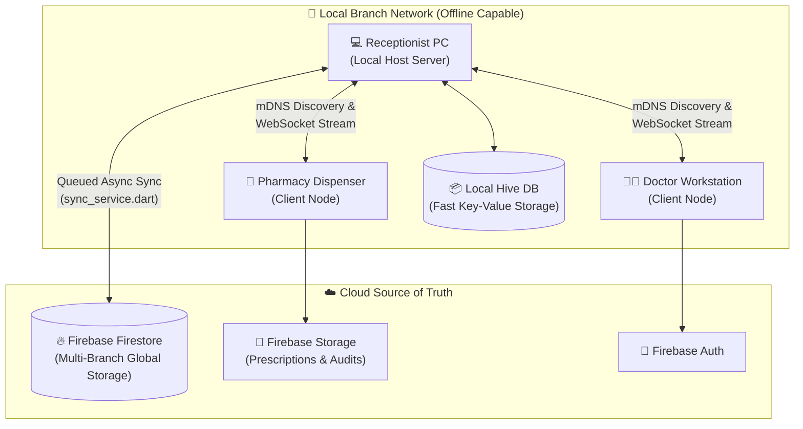
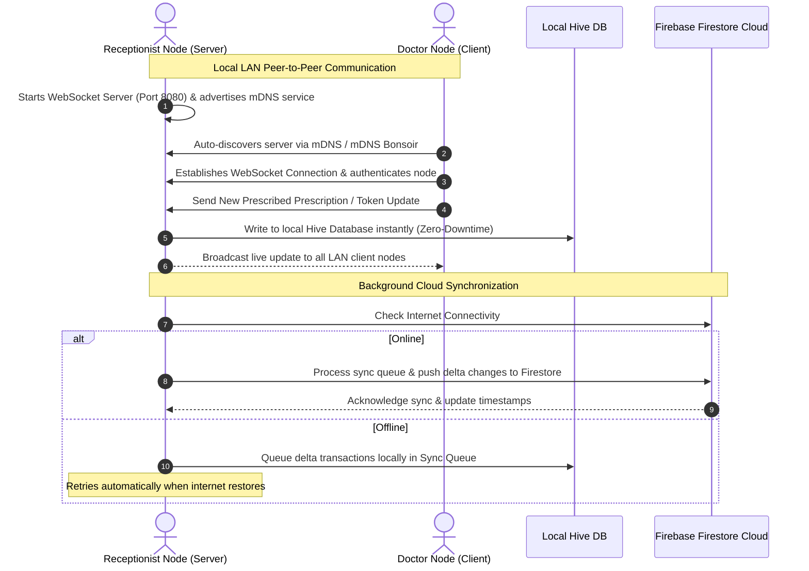
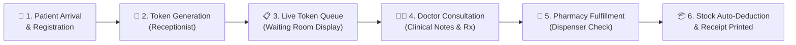
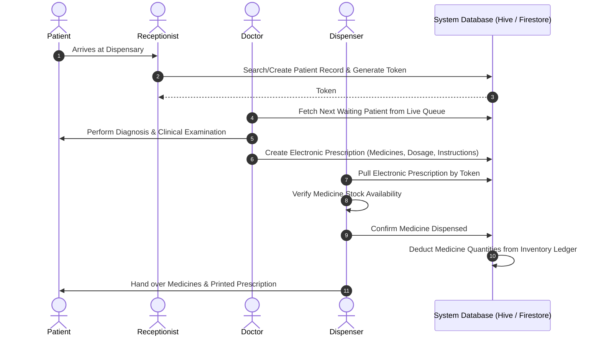
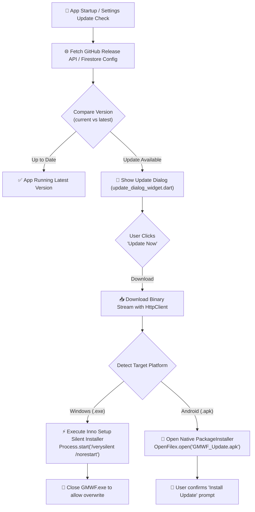

<p align="center">
  
</p>

# 🕌 Gulzar Madina Welfare Foundation (GMWF)
### Integrated Enterprise Welfare, Medical & Institution Management Platform

[](https://flutter.dev)
[](https://firebase.google.com)
[](https://flutter.dev/multi-platform)
[](https://github.com/gmwf-1122/GMWF)
[](LICENSE)

A production-grade, multi-platform **Flutter application** purpose-built for the Gulzar Madina Welfare Foundation. GMWF digitally orchestrates the foundation's entire operational ecosystem—spanning **medical dispensaries**, **educational institutions (Madrassa & School)**, **community kitchens (Dasterkhwaan)**, **financial auditing**, **biometric attendance**, **pre-authentication security**, and **automated multi-device session tracking**—with offline-first reliability and real-time synchronization.

---

## 🚀 Latest Updates in v1.2.9

> [!IMPORTANT]
> **Cross-Platform Auto-Updater Engine**
> The auto-update engine in v1.2.9 features platform-specific installer handoff, direct native package installation on Android (`open_filex` with `REQUEST_INSTALL_PACKAGES`), and silent setup execution on Windows.

- 🛠️ **Native In-App Android Updater**: Directly triggers the Android Package Installer (`content://` FileProvider) without manual browser downloads or Chrome save prompts.
- 💻 **Windows Silent Installer**: Automatically downloads `.exe` releases and executes Inno Setup silent setup switches (`/verysilent /suppressmsgboxes`).
- 🔒 **Pre-Authentication Security & Visitor Telemetry**: Logs device UUID, public IP, OS signatures, and connection metadata before login.
- 📱 **Session & Hardware Fingerprinting**: Accurately tracks Windows PCs, Web browsers, Android, and iOS devices connected to branch servers.

---

## 🏛️ Architecture & System Design

GMWF uses an **Offline-First Hybrid Sync Architecture**. Local branches function seamlessly even during total internet blackouts, using local LAN WebSockets for zero-latency intra-clinic data transfer and Cloud Firestore for global multi-branch persistence.



---

## 🖥️ Server & Network Architecture (`multi_server_service.dart` & `sync_service.dart`)

The foundation operates across distributed physical branches. The system handles local communication and cloud synchronization through a 3-layer network architecture:



### Server & Network Features:
1. **Local Server Host Engine** ([multi_server_service.dart](file:///e:/GMWF/gmwf/lib/services/multi_server_service.dart)): Designated branch terminals function as local WebSocket hubs broadcasting real-time updates to doctors and dispensers on the local subnet.
2. **Offline-First Persistence**: All transactions (patients, tokens, prescriptions, inventory) write to local Hive storage ([local_storage_service.dart](file:///e:/GMWF/gmwf/lib/services/local_storage_service.dart)) in less than 2 milliseconds.
3. **Background Sync Engine** ([sync_service.dart](file:///e:/GMWF/gmwf/lib/services/sync_service.dart)): Automatically queues pending offline operations and syncs them to Cloud Firestore when network connectivity returns.

---

## 🏥 Dispensary Workflow & Clinical Lifecycle

The dispensary module manages the end-to-end patient journey across reception, consultation, and pharmacy fulfillment:



### Dispensary Step-by-Step Details:



1. **Receptionist**: Searches existing patient records by CNIC/Phone or registers new patients. Generates sequential daily tokens.
2. **Doctor**: Views the live waiting list on the consultation dashboard, inputs vitals, selects diagnoses, and issues electronic prescriptions.
3. **Dispenser**: Opens the patient prescription on the pharmacy terminal, verifies medicine items, fulfills the order, and automatically updates inventory stock counts.

---

## ⚡ Cross-Platform Auto-Updater Engine

The application includes an automated multi-platform updater ([auto_update_service.dart](file:///e:/GMWF/gmwf/lib/services/auto_update_service.dart)) that keeps desktop and mobile clients updated with zero user friction:



---

## 🏛️ Foundation Modules & Capabilities

### 🏫 School & Madrassa Management System
- **Student Enrollment**: Complete demographic tracking (B-Form/CNIC, Guardian info, Branch assignment).
- **Hifz & Academic Logs**: Daily Quran recitation tracking, academic evaluations, and monthly progress cards.
- **Guardian Portal**: Parents view live attendance, academic progress, and fee statuses.

### 🍲 Dasterkhwaan (Community Kitchen Logistics)
- **Token Issuance**: Daily meal distribution tracking for community kitchens.
- **Pantry Inventory**: Stock management for 60+ ingredients with leftover carry-over calculations.
- **Daily Cooking Audits**: Audit trails linking meal counts to pantry stock usage.

### 💰 Financials, Donations & Credit Chain
- **Multi-Category Accounting**: Split tracking for Dispensary, Madrassa, Dasterkhwaan, and General Welfare funds.
- **Approval Workflow**: 3-Tier authorization chain (Office Boy ➔ Manager ➔ Chairman).
- **Branded Receipts**: A5 PDF receipt generation with instant WhatsApp sharing and Excel reporting.

---

## 👥 Organizational Roles & Access Control

| Role | Operational Scope & Permissions |
|:--|:--|
| **Chairman** | Global executive dashboard, financial audits, full multi-branch approval |
| **CEO** | Aggregate branch performance metrics & strategic overview |
| **HQ Manager** | Cross-branch credit ledgers, multi-branch operations, staff oversight |
| **Branch Manager** | Local branch administration, localized inventory approvals, daily reports |
| **Doctor** | Patient diagnosis, electronic prescriptions, medical history records |
| **Receptionist** | Patient registration, token queue management, visitor logging |
| **Dispenser** | Prescription fulfillment, medicine stock deduction, pharmacy audit |
| **Teacher / Admin** | Student enrollment, daily Hifz logs, academic report generation |
| **Kitchen Staff** | Meal token issuance, pantry stock logging, cooking session entry |

---

## 🛠️ Tech Stack & Dependencies

| Layer | Technology |
|:--|:--|
| **Framework** | Flutter 3.x (Dart `^3.10.1`) |
| **Local Persistence** | Hive (NoSQL Key-Value Store) |
| **State Management** | Flutter Riverpod + RxDart Streams + Provider |
| **Cloud Backend** | Firebase (Firestore, Authentication, Storage) |
| **Networking & LAN** | WebSockets (TCP Port 8080), mDNS (Bonsoir), HTTP Redirect Streamer |
| **Auto-Updater** | `open_filex`, GitHub Releases API, Inno Setup Compiler (`GMWFSetup.iss`) |
| **PDF & Printing** | `pdf` + `printing` package |
| **Security & Devices** | `device_info_plus`, `connectivity_plus`, `network_info_plus` |

---

## 📦 How to Build & Compile Releases

### 1. Build Windows Application
```bash
flutter build windows --release
```

### 2. Compile Inno Setup Windows Installer
Compile [GMWFSetup.iss](file:///e:/GMWF/gmwf/GMWFSetup.iss) using Inno Setup 6 to output:
```text
installer/GMWF-v1.2.9.exe
```

### 3. Build Android Release APK
```bash
flutter build apk --release
```
Output location:
```text
build/app/outputs/flutter-apk/app-release.apk
```

---

## 📄 License

© 2026 **Gulzar Madina Welfare Foundation (GMWF)**. All rights reserved.

This software is the exclusive property of GMWF. Unauthorized copying, distribution, or modification is strictly prohibited. See the [LICENSE](LICENSE) file for details.