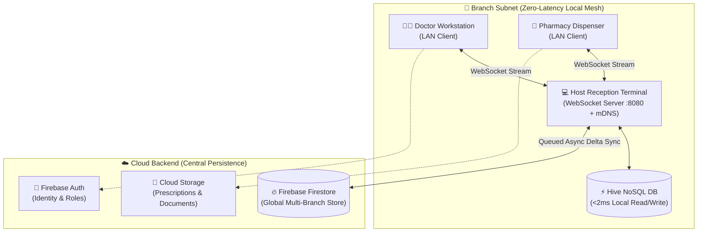
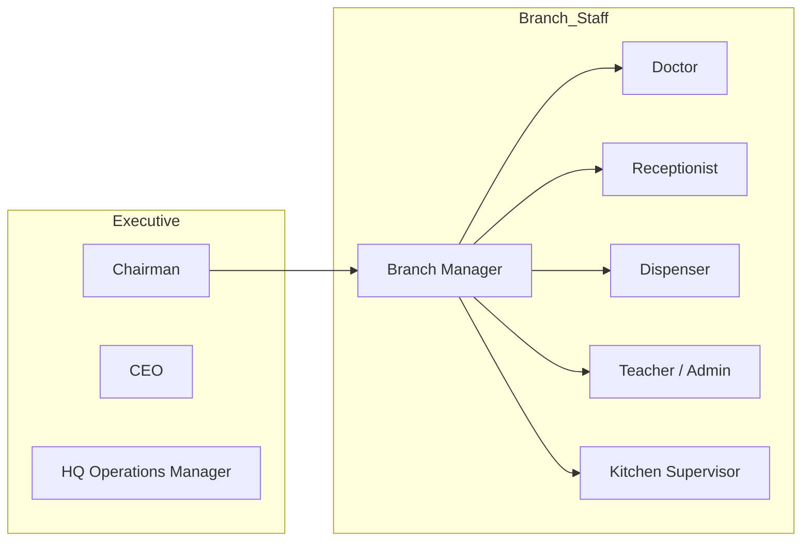

<p align="center">
  
</p>

<h1 align="center">Gulzar Madina Welfare Foundation (GMWF)</h1>

<p align="center">
  <strong>Integrated Enterprise Welfare, Medical, Education & Operations Platform</strong>
</p>

<p align="center">
  <a href="https://flutter.dev"></a>
  <a href="https://firebase.google.com"></a>
  <a href="https://hive.dev"></a>
  
  
  
</p>

---

## ⚡ Overview

**GMWF** is a mission-critical, multi-platform enterprise ecosystem engineered for the **Gulzar Madina Welfare Foundation**. Built on an **offline-first hybrid architecture**, it unifies medical healthcare, schooling, community welfare, biometric attendance, and multi-tier financial auditing across distributed branch networks with sub-millisecond local latency and automatic cloud synchronization.

> [!NOTE]
> **Zero-Downtime Guarantee**: Facilities operate uninterrupted during internet outages using local LAN peer-to-peer WebSocket mesh and encrypted on-device Hive storage. When connectivity resumes, deltas sync seamlessly with Cloud Firestore.

---

## 🏛️ Core Modules at a Glance

| Module | Purpose | Key Capabilities |
|:---|:---|:---|
| 🏥 **Dispensary & Pharmacy** | Clinical care & medicine distribution | Live token queue, electronic prescriptions (Rx), instant barcode/formula search, automated stock deduction, universal proforma catalog. |
| 📖 **Madrassa & Education** | Hifz & academic management | Student registration, Islamic calendar support, Quran Juz/Para progress logs, guardian report cards, monthly grade sheets. |
| 🏫 **Model School** | Primary/secondary education | Admissions, fee collection & concession logic, student/teacher biometric attendance, library book circulation, PDF report generation. |
| 🍲 **Dasterkhwaan** | Community kitchen logistics | Meal token allocation, 60+ ingredient pantry inventory, daily cooking consumption logs, automated meal cost auditing. |
| 💳 **Finance & Donations** | Institutional auditability | Multi-fund donation ledgers, 3-tier approval chain (Staff ➔ Manager ➔ Chairman), A5 WhatsApp/print receipts, Excel/CSV exports. |
| ⏱️ **Biometric & Attendance** | Workforce administration | ZKTeco hardware integration, multi-branch punch synchronization, shift breakdown, automated payroll processing. |

---

## 🏗️ System Architecture

### Offline-First Hybrid Topology



---

## 🚀 Key Architectural Innovations

### 1. Smart Multi-Tier Auto-Update
Clients update smoothly without exceptions, rate-limit bottlenecks, or disrupted workflows:
- **Multi-Tier Detection**: GitHub Releases API ➔ Firestore Remote Config (`app_config/version`) ➔ Raw GitHub CDN check.
- **Responsive Layout**: Optimal card geometry (`max-height: 85vh`) with fixed header, stationary bottom action buttons, and scrollable release notes.
- **Version-Aware Snooze**: Postpones minor notifications without suppressing critical or mandatory updates.
- **Robust In-App Streaming**: Resilient HTTP chunk streaming with automatic Windows file-lock avoidance (OS Error 32 handling).

### 2. Python Environment Preservation (Inno Setup)
- Both 64-bit (`GMWFSetup.iss`) and 32-bit (`GMWFSetup_x86.iss`) installers automatically probe `{app}\python\python.exe`.
- Existing Python runtimes, biometric drivers, and packages are **preserved without overwriting**, ensuring zero hardware driver disruption during updates.

### 3. Pre-Authentication Security & Token Lifecycle
- Device fingerprinting and activity logs recorded before credential verification.
- Offline credentials securely hashed with local fallback authentication during branch blackouts.

---

## 👥 Role-Based Access Control



- **Executive (Chairman / CEO / HQ)**: Organization-wide financial oversight, multi-branch analytics, and final transaction approvals.
- **Branch Management**: Branch stock requisition, local expense approvals, and staff scheduling.
- **Clinical (Doctor / Dispenser / Receptionist)**: Patient queuing, diagnosis, electronic prescription issuance, and stock deduction.
- **Educational (Teachers / Admin)**: Quranic recitation logs, student enrollments, exam grading, and parent communications.

---

## 🛠️ Technology Stack

| Category | Components |
|:---|:---|
| **Framework** | Flutter 3.x • Dart `^3.10.1` |
| **Local Database** | Hive NoSQL (Box-based key-value persistence) |
| **Cloud Services** | Firebase Firestore • Auth • Cloud Storage |
| **Networking** | WebSockets (TCP :8080) • mDNS (Bonsoir) • HttpClient |
| **Hardware & Devices**| ZKTeco Python Sync Daemon • Windows Biometric APIs |
| **Packaging & Installers** | Inno Setup 6 (x64 / x86) • Android Split ABI APKs • Web Deployments |

---

## 📦 Building from Source

```bash
# 1. Fetch dependencies
flutter pub get

# 2. Compile Windows release executable
flutter build windows --release

# 3. Compile Android release (Split ABI for compact download size)
flutter build apk --release --split-per-abi

# 4. Compile Web release bundle
flutter build web --release
```

### Windows Installer Generation
Compile `GMWFSetup.iss` (x64) or `GMWFSetup_x86.iss` (32-bit) with Inno Setup 6:
```text
installer/GMWF-v1.4.4-x64.exe
installer/GMWF-v1.4.4-x86.exe
```

---

## 📄 License & Ownership

© 2026 **Gulzar Madina Welfare Foundation (GMWF)**. All rights reserved.  
Proprietary software developed exclusively for GMWF operations. Unauthorized duplication or redistribution is strictly prohibited.