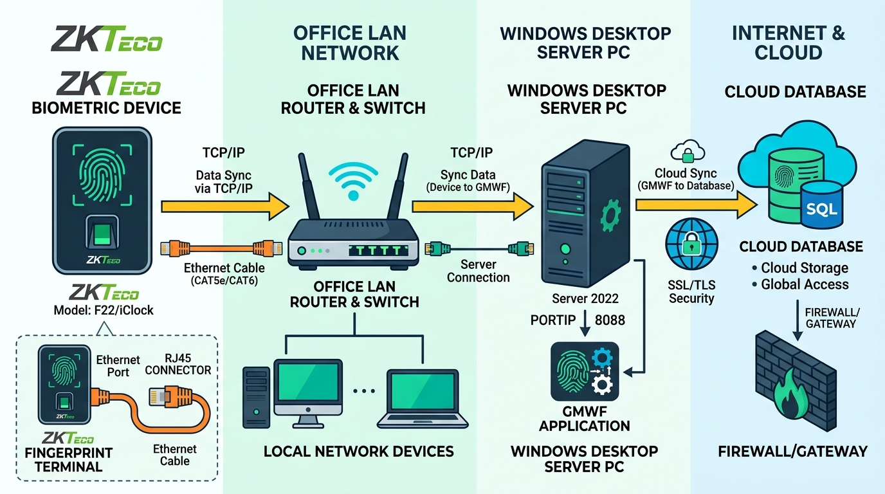
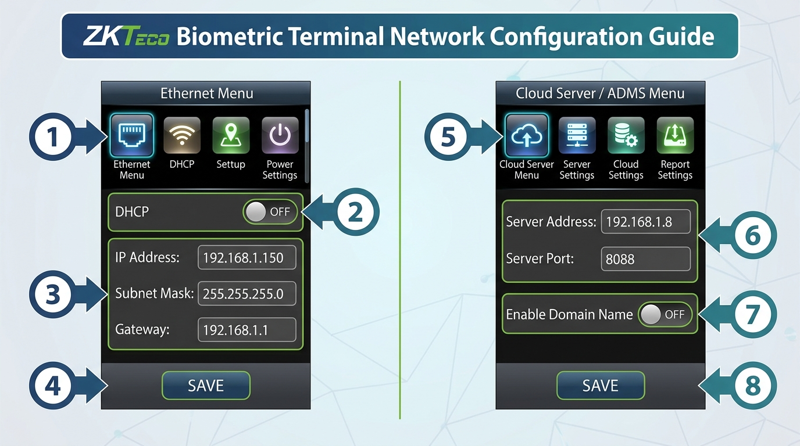
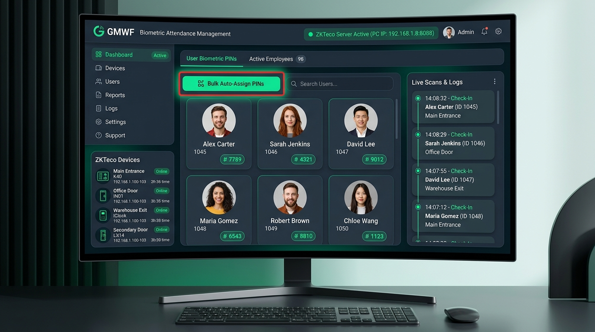

# 📖 ZKTeco Biometric Device Setup & Connection Guide

Complete step-by-step visual guide for connecting ZKTeco fingerprint/thumb machines to the **GMWF Desktop Application & LAN Server**.

---

## 📑 Table of Contents
1. [Overview & Network Architecture](#1-overview--network-architecture)
2. [Step 1: Physical LAN Connection](#2-step-1-physical-lan-connection)
3. [Step 2: ZKTeco Physical Machine Configuration](#3-step-2-zkteco-physical-machine-configuration)
   - [A. Set Static IP (Turn OFF DHCP)](#a-set-static-ip-turn-off-dhcp)
   - [B. Configure Cloud Server / ADMS Push (Port 8088)](#b-configure-cloud-server--adms-push-port-8088)
4. [Step 3: GMWF App Setup & PIN Mapping](#4-step-3-gmwf-app-setup--pin-mapping)
5. [Step 4: Windows Firewall Whitelist](#5-step-4-windows-firewall-whitelist)
6. [Step 5: Testing Live Scans](#6-step-5-testing-live-scans)
7. [🔍 Troubleshooting & Diagnostics](#7-troubleshooting--diagnostics)

---

## 1. Overview & Network Architecture

GMWF connects to ZKTeco thumb machines seamlessly over your local office network:



### How Data Flows:
* **Instant ADMS Push (Port 8088)**: Whenever an employee scans their finger, the ZKTeco machine sends a real-time HTTP POST directly to the GMWF Desktop Server PC.
* **Zero Internet Dependency**: Local attendance recording works 100% offline inside the building.
* **Cloud Sync**: When internet is available, GMWF automatically synchronizes attendance logs to Cloud Firestore.

---

## 2. Step 1: Physical LAN Connection

1. **Connect Cable**: Plug an Ethernet cable (RJ-45) from your ZKTeco machine into your office router or network switch.
2. **Same Network**: Ensure your Windows Server PC and the ZKTeco machine are plugged into the **same router**.
3. **Find PC IP Address**:
   - Open PowerShell or Command Prompt on the Windows PC and type:
     ```cmd
     ipconfig
     ```
   - Note down the **IPv4 Address** (e.g., `192.168.1.8` or `192.168.10.28`) and **Default Gateway** (e.g., `192.168.1.1` or `192.168.10.1`).

---

## 3. Step 2: ZKTeco Physical Machine Configuration

Follow the visual guide below on the physical ZKTeco LCD screen:



### A. Set Static IP (Turn OFF DHCP)
1. Press the **[M/OK]** button on the machine to open the Main Menu.
2. Navigate to **Comm.** (Communication) ➔ **Ethernet**.
3. Set **DHCP** ➔ `OFF` *(Crucial so the IP never changes)*.
4. Enter the network settings:
   - **IP Address**: e.g., `192.168.1.150` (must be within your router's IP range).
   - **Subnet Mask**: `255.255.255.0`
   - **Gateway**: Your router's gateway (e.g., `192.168.1.1` or `192.168.10.1`).
5. Press **[OK]** / **[Save]**.

---

### B. Configure Cloud Server / ADMS Push (Port 8088)
1. In the Main Menu, navigate to **Comm.** ➔ **Cloud Server Setting** (or **ADMS** / **Web Server Setting**).
2. Configure the following fields:
   - **Enable Domain Name**: `OFF` / `No`
   - **Server Address**: Enter your **Server PC's IP Address** (e.g., `192.168.1.8` or `192.168.10.28`).
   - **Server Port**: `8088`
   - **Enable Proxy Server**: `OFF` / `No`
3. Press **[OK]** to save and restart the device.

---

## 4. Step 3: GMWF App Setup & PIN Mapping



> [!IMPORTANT]
> When an employee punches their finger, the ZKTeco scanner sends their **numeric User ID / PIN** (e.g., `1`, `101`). If this PIN is not linked in GMWF, the system flags it as **Unmapped User** and will not mark attendance.

### 1. Start the Server
* Open GMWF Desktop App ➔ Go to **Server** or **Settings ➔ Biometric Attendance Settings & Devices**.
* Click **"Start Server"**.
* The top status banner will turn green: `✅ ZKTeco Server Active (PC IP: 192.168.x.x:8088)`.

### 2. Auto-Assign Biometric PINs (1-Click)
* Click on the **User Biometric PINs** tab.
* Click the green **"Bulk Auto-Assign PINs"** button.
* The app will automatically map all registered employee IDs to their biometric PINs.

### 3. Manually Link a User PIN
* Click **"Link User PIN"** to map any specific User ID to an Employee, Teacher, School Student, or Madrassa Student.

---

## 5. Step 4: Windows Firewall Whitelist

Run PowerShell as **Administrator** and run this command once to prevent Windows Firewall from blocking incoming scans:

```powershell
New-NetFirewallRule -DisplayName "GMWF ZKTeco ADMS Server (8088)" -Direction Inbound -LocalPort 8088 -Protocol TCP -Action Allow
New-NetFirewallRule -DisplayName "GMWF ZKTeco Hardware Port (4370)" -Direction Inbound -LocalPort 4370 -Protocol TCP -Action Allow
New-NetFirewallRule -DisplayName "GMWF ZKTeco UDP Handshake (4370)" -Direction Inbound -LocalPort 4370 -Protocol UDP -Action Allow
```

---

## 6. Step 5: Testing Live Scans

1. In the GMWF Desktop App, open **Settings ➔ Biometric Attendance Settings & Devices**.
2. Switch to the **"Live Scans & Logs"** tab.
3. Place a finger on the physical ZKTeco scanner.
4. **Within 1–2 seconds**:
   - The user's name, profile photo, time, and location will appear in the live feed.
   - Attendance is automatically marked as **Present** with exact **Check-In / Check-Out time**.

---

## 7. 🔍 Troubleshooting & Diagnostics

| Symptom | Cause | Solution |
|---|---|---|
| **Device status shows "Offline"** | IP mismatch or cable disconnected | Verify Ethernet cable is plugged in. Ensure PC and device share the same subnet (e.g., both on `192.168.1.x`). |
| **Punch received as "Unmapped User"** | PIN not mapped to profile | Open **User Biometric PINs** tab in GMWF and click **Bulk Auto-Assign PINs**. |
| **Server status shows "Stopped"** | Listener not active | Click **"Start Server"** on the Biometric Settings page. |
| **Punches not syncing to Cloud** | Firebase Quota exceeded (429) | Upgrade Firebase to **Blaze Plan** (Pay-As-You-Go with free tier) or wait for daily midnight UTC quota reset. |

---
*Maintained for Ghulam Muhammad Welfare Foundation (GMWF) IT & Operations Team.*
